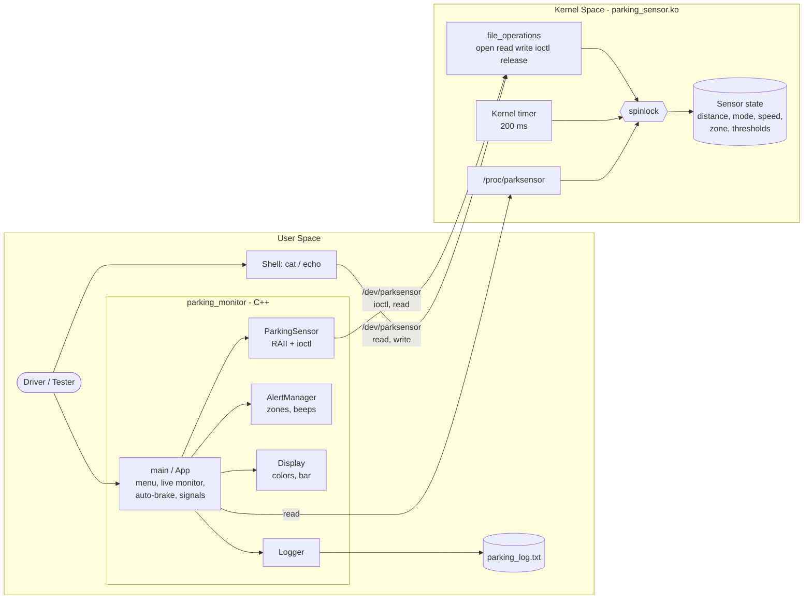

# Stage 3 – System Design & Architecture

## 3.1 Overall Architecture

The system follows the classic Linux layered architecture: hardware access in
kernel space, policy and user interaction in user space, connected by a device
file and a well-defined ioctl API.



### Layers
| Layer | Components | Role |
|---|---|---|
| Presentation | `Display`, menu in `main.cpp` | Shows readings, alerts, menus |
| Application logic | `App`, `AlertManager`, `Logger` | Live monitoring, auto-brake, zone transitions, logging |
| Device access | `ParkingSensor`, `SensorException` | Wraps system calls, converts errors to exceptions |
| Kernel interface | `include/parking_sensor_ioctl.h` | Shared contract between kernel and user space |
| Driver | `parking_sensor.c` | Device registration, file operations, simulation, procfs |

## 3.2 Components and Responsibilities

| Component | Responsibilities |
|---|---|
| **Driver init/exit** | Allocate major/minor, register cdev, create class + device node (mode 0666), create procfs entry, start/stop timer, clean up in reverse order on failure. |
| **file_operations** | `open`/`release` (count opens), `read` (text sample, one per open), `write` (text commands), `unlocked_ioctl` (binary API). |
| **Simulation timer** | Every 200 ms: move car by `speed ± 1 cm` according to mode, clamp to 0–400 cm, update zone, stop at limits, re-arm unless unloading. |
| **Zone logic** | `ps_classify()` in the shared header – identical in kernel and tests. |
| **procfs** | Snapshot state under the lock and print statistics. |
| **ParkingSensor (C++)** | Owns the file descriptor (RAII), one method per ioctl, throws `SensorException` with errno. |
| **AlertManager (C++)** | Maps raw zone to `Zone` enum, messages, beep intervals; tracks current/previous zone and number of transitions. |
| **Display (C++)** | Card view, single-line live view, colors per zone, distance bar. |
| **Logger (C++)** | Append timestamped entries, return last N lines. |
| **App / main (C++)** | Menu loop, input validation, live monitor loop, auto-brake, SIGINT handling, command-line options. |

## 3.3 Data Structures

### Shared (kernel ↔ user) – `include/parking_sensor_ioctl.h`
```c
enum ps_zone { PS_ZONE_SAFE, PS_ZONE_CAUTION, PS_ZONE_DANGER, PS_ZONE_STOP };
enum ps_mode { PS_MODE_IDLE, PS_MODE_REVERSING, PS_MODE_FORWARD };

struct ps_reading {            /* returned by PS_IOC_GET_READING */
    int32_t  distance_cm;
    int32_t  zone;
    int32_t  mode;
    int32_t  speed_cm;
    uint32_t sample_count;
};

struct ps_thresholds {         /* caution > danger > stop >= 0 */
    int32_t caution_cm;
    int32_t danger_cm;
    int32_t stop_cm;
};
```
Fixed-width types are used so the layout is identical in kernel and user space.

### Kernel private – `struct ps_device`
| Field | Purpose |
|---|---|
| `dev_t devt`, `struct cdev cdev` | device number and character device |
| `struct class *class`, `struct device *device` | sysfs class + `/dev` node |
| `struct proc_dir_entry *proc` | `/proc/parksensor` |
| `struct timer_list timer`, `bool stopping` | simulation timer, stop flag for unload |
| `spinlock_t lock` | protects all fields below |
| `distance_cm, mode, speed_cm, zone, thr` | sensor state |
| `sample_count, zone_changes, open_count` | statistics |

### ioctl commands
| Command | Direction | Payload |
|---|---|---|
| `PS_IOC_GET_READING` | `_IOR` | `struct ps_reading` |
| `PS_IOC_SET_DISTANCE` | `_IOW` | `int32_t` |
| `PS_IOC_SET_MODE` | `_IOW` | `int32_t` |
| `PS_IOC_SET_SPEED` | `_IOW` | `int32_t` |
| `PS_IOC_SET_THRESHOLDS` | `_IOW` | `struct ps_thresholds` |
| `PS_IOC_GET_THRESHOLDS` | `_IOR` | `struct ps_thresholds` |
| `PS_IOC_RESET` | `_IO` | – |

## 3.4 UML Diagrams
Class, sequence and state machine diagrams are in
[UML_Diagrams.md](UML_Diagrams.md).

## 3.5 Key Design Decisions
| Decision | Reason |
|---|---|
| Spinlock instead of mutex | The timer callback runs in softirq context where sleeping (mutex) is not allowed. Process context uses `spin_lock_bh` to avoid deadlock with the timer on the same CPU. |
| Shared header with `ps_classify()` | Kernel and application can never disagree on zone boundaries; the rule is unit-testable in user space. |
| Binary ioctl API for the app, text read/write for the shell | ioctl is type-safe and efficient; text interface makes manual testing and demos easy. |
| `read()` returns one sample per open | Makes `cat /dev/parksensor` terminate instead of looping forever. |
| Device node mode 0666 via `devnode` callback | Application runs without `sudo`. |
| `stopping` flag before `timer_delete_sync` | Guarantees the self re-arming timer cannot restart during unload. |
| RAII `ParkingSensor` | File descriptor is always closed, even when exceptions are thrown. |
| `AlertManager` without I/O | Pure logic is unit-testable without hardware or driver. |

## 3.6 Implementation Plan
| Step | Task | Verification |
|---|---|---|
| 1 | Shared header with structs and ioctl codes | Compiles in kernel and user space |
| 2 | Driver skeleton: init/exit, cdev, class, device | `insmod` creates `/dev/parksensor`, `rmmod` cleans up |
| 3 | `read()` text sample | `cat /dev/parksensor` |
| 4 | ioctl API + validation | integration tests |
| 5 | Kernel timer simulation + zone tracking | `dmesg` shows zone changes |
| 6 | `write()` text commands, procfs, module parameter | shell tests |
| 7 | C++ `ParkingSensor`, `SensorException` | integration tests |
| 8 | `AlertManager`, `Display`, `Logger` | unit tests |
| 9 | Menu, live monitor, auto-brake, signals | system test / demo |
| 10 | Documentation and final polish | review |

## 3.7 Development Environment
| Tool | Version / Note |
|---|---|
| OS | Ubuntu 22.04 or 24.04 (VirtualBox/VMware VM recommended) |
| Compiler | GCC/G++ (C++17) |
| Kernel headers | `linux-headers-$(uname -r)` |
| Build | GNU Make, Kbuild |
| Editor | VS Code (Remote-SSH into the VM) or any editor |
| Debugging | `dmesg`, `printk`/`pr_info`, `gdb` for user space |
| Version control | Git + GitHub |

Setup:
```bash
sudo apt update
sudo apt install build-essential linux-headers-$(uname -r) git
```

## 3.8 Git Repository & Branching Strategy

```
main ──●─────────────●────────────●──────────●── (stable, tagged per stage)
        \           /  \         /  \       /
develop  ●──●──●──●     ●──●──●─     ●──●──●
            \    /         \  /
feature/*    ●──●           ●●
```

| Branch | Purpose |
|---|---|
| `main` | Stable, demonstrable versions only. Tagged `v0.1-stage1` … `v1.0-final`. |
| `develop` | Integration branch for completed features. |
| `feature/<name>` | One feature each, e.g. `feature/driver-skeleton`, `feature/ioctl-api`, `feature/kernel-timer`, `feature/cpp-dashboard`, `feature/tests`. |
| `docs/<stage>` | Documentation updates per stage. |

**Commit message convention**
```
<type>(<scope>): <summary>

type  = feat | fix | docs | test | refactor | build
scope = driver | app | tests | docs
e.g.  feat(driver): add kernel timer to simulate vehicle movement
```

## 3.9 Documentation & Progress Tracking
- Each stage has its own document in `docs/`.
- Progress, issues and solutions are recorded in
  [04_Implementation_Progress.md](04_Implementation_Progress.md).
- Test cases and results are recorded in [05_Testing.md](05_Testing.md).
- GitHub Issues / a project board can be used to track open tasks.

## 3.10 Next Stage
Stage 4 implements the driver and the application prototype following the
implementation plan above.
