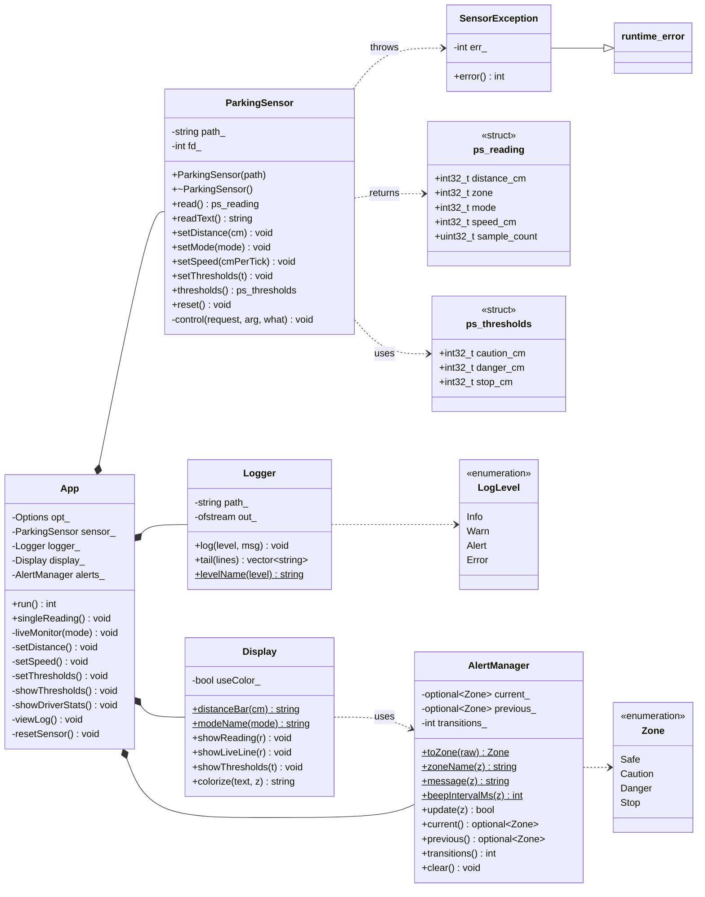
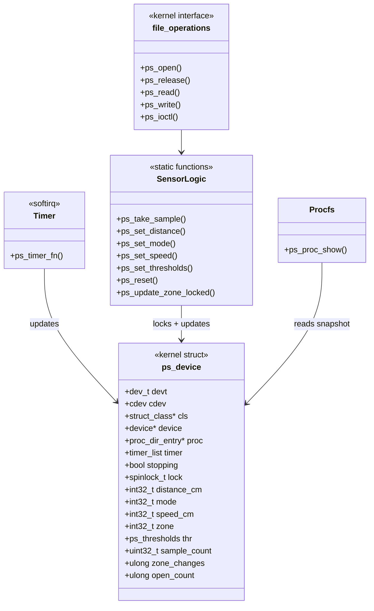
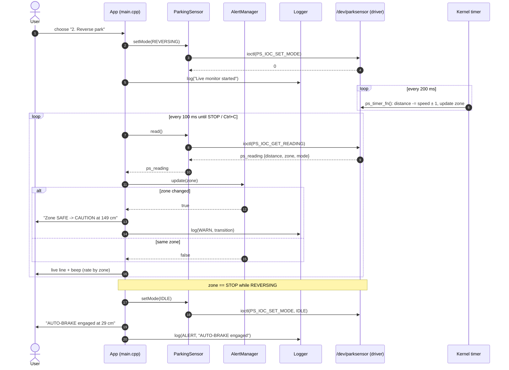
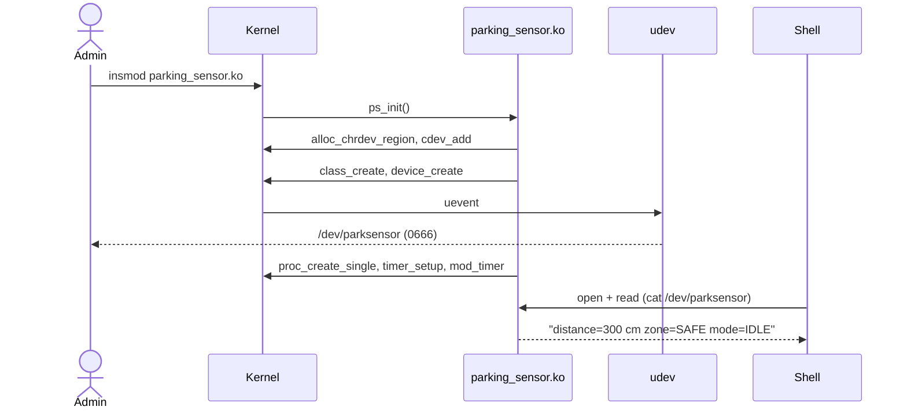
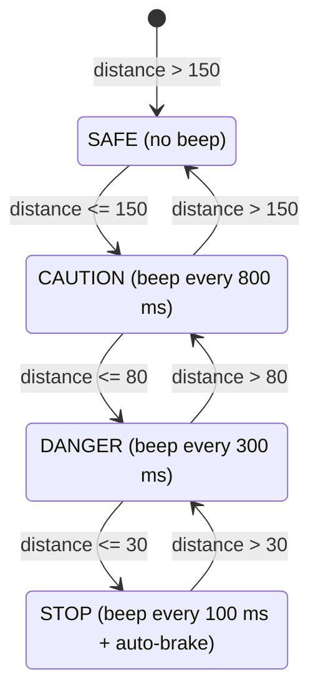
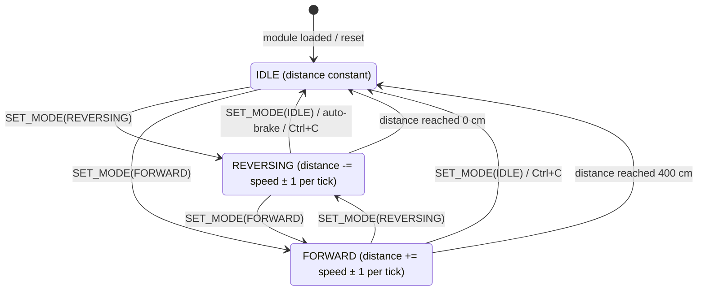
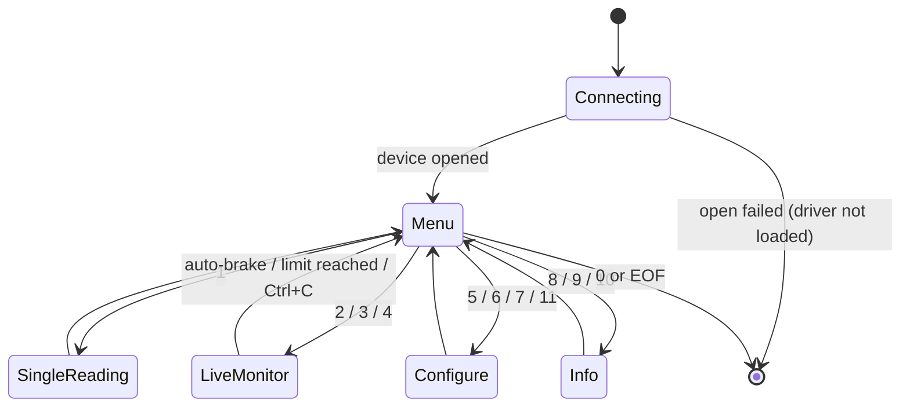

# UML Diagrams

All diagrams are written in Mermaid and render directly on GitHub.

---

## 1. Class Diagram (user-space application)

## 2. Kernel Driver Structure (component view)

---

## 3. Sequence Diagram – Reverse parking with auto-brake

## 4. Sequence Diagram – Module load and first read

---

## 5. State Machine – Proximity zones

Zone transitions depend only on the distance and the thresholds
(defaults: caution 150, danger 80, stop 30 cm).

## 6. State Machine – Vehicle mode (driver)

## 7. State Machine – Application

